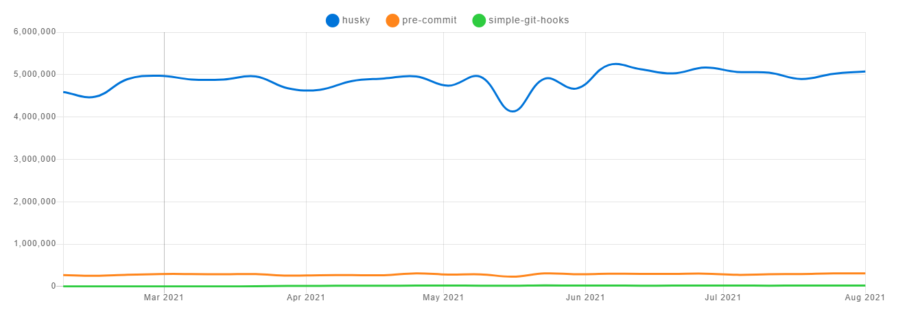

<!--
paginate: false
-->

<style>
h1 {
  padding-top: 6.5rem;
  text-align: center;
  vertical-align: middle;
}
h2 {
  font-size: 36px;
}
section {
    font-family: "Arial", "Hiragino Maru Gothic ProN";
    font-size: 32px;
    /* padding: 40px; */
}
</style>

# huskyについて

---
<!--
paginate: true
-->

## 目次
- 自己紹介
- huskyとGit hooksについて
- husky v4とhusky v5以降の違い
- husky以外の選択肢
- まとめ

---

# 自己紹介

---

## 自己紹介
- 名前：日髙廉都（ひたかれんと）
- 所属：Integration UNIT 1
- 出身：九州の大分県出身
- 趣味：将棋、筋トレ

---

# huskyとGit hooksについて

---

## huskyとは
- huskyとは
  - Git hooksが簡単に利用できるnpmライブラリ
  - フックスクリプトをGit管理できる

---

## Git hooksとは
- Git hooksとは
  - コミットやプッシュなど、Gitでコマンドを実行する直前もしくは実行後に特定のスクリプト(フックスクリプト)を実行するための仕組み
  - フックスクリプトの例
    - コミットする直前に実行される 「pre-commit」
    - コミット時に実行される 「commit-msg」
  - 具体的な使い方の例
    - コミット前のフックでlinter・formatterを実行させる(CIから通知される前にlinter・formatterの実行漏れに気づくことができる)

---
## Git hooksの使い方
- Gitリポジトリを作成した時点でGit hooksは利用できる状態となっている
```bash
# Gitリポジトリを作成
$ git init
# デフォルトではフックスクリプトのファイル名の末尾が .sample となっているので適宜リネームして利用する。
# gitの特定の操作に対応する .git/hooks配下のフックスクリプトが実行される。
$ ls .git/hooks/
applypatch-msg.sample*  fsmonitor-watchman.sample*  pre-applypatch.sample*  pre-merge-commit.sample*  pre-rebase.sample*   prepare-commit-msg.sample*
commit-msg.sample*      post-update.sample*         pre-commit.sample*      pre-push.sample*          pre-receive.sample*  update.sample*
```

※ .git 配下のファイルはバージョン管理されないため、デフォルトだとフックスクリプトをリポジトリ経由で共有できない。

---

# husky v4とhusky v5以降の違い

---

## husky v4の設定方法

- 初期設定
```bash
$ npm install husky@4 --save-dev
```
- Git hooks 用のスクリプト追加(package.json)
```json
"husky": {
  "hooks": {
    "pre-commit": "npm test"
  }
},
```
※ package.json以外でも設定可能（例： .huskyrc ）

---
## husky v5以降の設定方法

- 初期設定
```bash
$ npm install husky@7 --save-dev
$ npm set-script prepare "husky install"
$ npm run prepare
```
- Git hooks 用のスクリプト追加
```bash
$ npx husky add .husky/pre-commit "npm test"
```
---

## 思ったこと
- huskyについて調べるとv4の時の設定方法が説明されている記事が多く、huskyの公式ドキュメントと設定方法が違ってて若干混乱した
- v4の方が初期設定がシンプル
  - `npm install`するだけで初期設定は完了
- v5以降のバージョンを使うメリットは何なのか？

---
## husky v4でGit hooksが実行される仕組み

- husky v4 をインストールすると、 自動で .git/hooks 配下に各種フックスクリプトが追加される。
```bash
$ ls -1 .git/hooks | grep -v .sample
$ npm install husky@4 --save-dev
$ ls -1 .git/hooks | grep -v .sample
applypatch-msg
commit-msg
husky.local.sh
husky.sh
post-applypatch
post-checkout
post-commit
post-merge
post-rewrite
# 略
```

---
## husky v4でGit hooksが実行される仕組み
- 各種フックスクリプトの中身
```shell
#!/bin/sh
# husky

. "$(dirname "$0")/husky.sh"
```

- 各種フックスクリプトでは共通のスクリプト( husky.sh )を実行する
- husky.sh では、package.json や .huskyrc 内に書かれた Git hooks 用のコマンドを実行する
---
## husky v5以降でGit hooksが実行される仕組み
- huskyのインストールのみでは特に何も起きない。フックスクリプトも追加されない。
```bash
$ npm install husky@7
$ ls -1 .git/hooks | grep -v .sample
$ cat .git/config
[core]
	repositoryformatversion = 0
	filemode = true
	bare = false
	logallrefupdates = true
```

---
## husky v5以降でGit hooksが実行される仕組み
- husky install を行うと、core.hooksPath = .husky が設定される。
```bash
$ npm set-script prepare "husky install"
$ npm run prepare
$ cat .git/config
[core]
	repositoryformatversion = 0
	filemode = true
	bare = false
	logallrefupdates = true
	hooksPath = .husky
```

※ core.hooksPathとは、フックスクリプトの配置場所を変更するための設定のこと。デフォルトでは .git/hooks というパスがフックスクリプトの配置場所だが、core.hooksPath を設定することでその場所を上書きできる。

---
## husky v5以降でGit hooksが実行される仕組み
- hooksPath が指定している .husky ディレクトリ も作成されている。
```bash
$ ls -A -R .husky
.:
_/

./_:
.gitignore  husky.sh

# .git/hooks 配下に変化はなし
$ ls -1 .git/hooks | grep -v .sample
```

---
## husky v5以降でGit hooksが実行される仕組み
- `husky add`コマンドで .husky 配下にフックスクリプトが作成される
```bash
$ npx husky add .husky/pre-commit "npm test"
$ cat .husky/pre-commit
#!/bin/sh
. "$(dirname "$0")/_/husky.sh"

npm test
```

※ core.hooksPathの設定でフックスクリプトの配置場所が .husky となっているので、特定のgit操作が行われ場合に、 .husky に配置してあるフックスクリプトが実行される。

---

## husky v4の課題
- すべてのフックスクリプトを .git/hooks 配下に設置するため、必要ない (ユーザー側が定義していない) フックスクリプトが実行される。
  - 重い
- `npm install`時に自動でシェルスクリプトを配置するようにしていたが、パッケージマネージャ側のキャッシュが働く関係でうまくインストールできない問題があった
&darr;

- Git2.9で導入された core.hooksPath を使うことで、課題を解消した。
  - フックスクリプトは .git/hooks 配下に設置しない。必要なフックスクリプトのみを .husky 配下に設置する。
- 自動インストールは実行せず、インストール用のコマンドを用意した。

---

# husky以外の選択肢

---
## pre-commit

- インストール
```bash
$ ls -1 .git/hooks | grep -v .sample
$ npm install --save-dev pre-commit
$ ls -1 .git/hooks | grep -v .sample
pre-commit
$ cat .git/hooks/pre-commit
#!/bin/bash
./node_modules/pre-commit/hook
RESULT=$?
[ $RESULT -ne 0 ] && exit 1
exit 0
```

---
## pre-commit

- Git hooks 用のスクリプト追加(package.json)
```json
{
  "pre-commit": [
    "test"
  ]
}
```

---
## simple-git-hooks

- インストール
```bash
$ npm install simple-git-hooks --save-dev
```
- Git hooks 用のスクリプト追加(package.json)
```json
{
  "simple-git-hooks": {
    "pre-commit": "npm run test"
  }
}

```

---
## simple-git-hooks
- package.jsonのスクリプトを.git/hooks/にコピー
```bash
$ ls -l .git/hooks | grep -v .sample
$ npx simple-git-hooks
[INFO] Successfully set the pre-commit with command: npm run test
[INFO] Successfully set all git hooks
$ ls -l .git/hooks | grep -v .sample
pre-commit
$ cat .git/hooks/pre-commit
#!/bin/sh
npm run test
```
---
- simple-git-hooksのメリット
  - global hookとlocal hookを同時に使用できる
- デメリット
  - global hookとlocal hookを同時に使用できない(core.hooksPathはglobalを無視する)

---
## 各ライブラリのダウンロード数の比較
- huskyが圧倒的に人気


---
## ライブラリを使用しない
- 初期設定
```bash
$ mkdir .githooks
```
- .githooks/pre-commit を作成してフックスクリプトを作成
```shell
#!/bin/sh
npm run test
```
- prepareスクリプトでcore.hooksPathを上書き
```
$ npm set-script prepare "git config --local core.hooksPath .githooks"
$ npm run prepare
```
---
- ライブラリを使用しない場合のメリット
  - ライブラリの機能に依存しない
- デメリット
  - `husky add`のようなコマンドが使えない

---
# まとめ

---

## まとめ
- husky v5以降について
  - 自動インストールされないのは若干手間だが

---